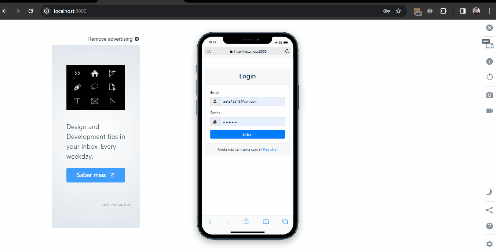

# Sistema de Pedidos SWL:
Introdução ao sistema de pedido SWL
•	Cadastro de usuários
•	Login
•	Logout

•	API de CEP
•	Inserção de Pedidos
•	Cálculo de envio de acordo com a opção selecionada

•	Atualização de Pedido

•	Exclusão de Pedido
